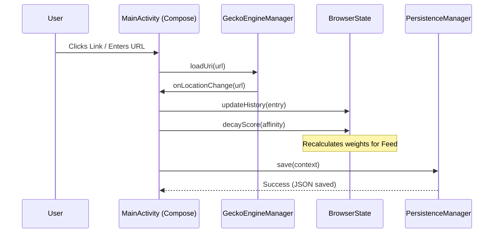

# 🗺️ Malachite App Map

Welcome to the developer documentation for Malachite. This guide helps you understand the architecture, data flow, and key components of the browser.

---

## 🏗️ Project Architecture

Malachite is built using **Jetpack Compose** and **GeckoView**. It uses a centralized state pattern to manage browser sessions and user affinity data.

### Core Modules & Links

| Component | Responsibility | Source Link |
| :--- | :--- | :--- |
| **Entry Point** | Manages Activity lifecycle and initializes the Compose UI. | [MainActivity.kt](file:///home/nadia/StudioProjects/malachite/app/src/main/java/com/example/MainActivity.kt) |
| **State Engine** | Centralized `BrowserState` object holding history, domains, and active sessions. | [BrowserState.kt](file:///home/nadia/StudioProjects/malachite/app/src/main/java/com/example/BrowserState.kt) |
| **Gecko Manager** | Handles `GeckoRuntime` initialization, session creation, and extensions. | [GeckoEngineManager.kt](file:///home/nadia/StudioProjects/malachite/app/src/main/java/com/example/GeckoEngineManager.kt) |
| **Persistence** | Saves and loads the browser database (JSON) to local storage. | [PersistenceManager.kt](file:///home/nadia/StudioProjects/malachite/app/src/main/java/com/example/PersistenceManager.kt) |
| **Identity** | Handles verified email retrieval using Android Credential Manager. | [IdentityManager.kt](file:///home/nadia/StudioProjects/malachite/app/src/main/java/com/example/IdentityManager.kt) |

---

## 🔄 Function Flow: Page Navigation & Scoring

This diagram illustrates how the app handles navigation and updates the affinity scoring system.

---

## 🛠️ Developer Help

### How to...

#### 1. Add a New Component to the UI
Most UI code resides in the `BrowserApp` composable within `MainActivity.kt`. For complex screens (like History or Favorites), see:
- [HistoryActivity.kt](file:///home/nadia/StudioProjects/malachite/app/src/main/java/com/example/HistoryActivity.kt)
- [SettingsActivity.kt](file:///home/nadia/StudioProjects/malachite/app/src/main/java/com/example/SettingsActivity.kt)

#### 2. Modify GeckoView Settings
Adjusting engine parameters, remote debugging, or extensions should be done in [GeckoEngineManager.kt](file:///home/nadia/StudioProjects/malachite/app/src/main/java/com/example/GeckoEngineManager.kt).

#### 3. Tweak the Scoring Algorithm
The weighted random selection and score decay logic are located in [MainActivity.kt](file:///home/nadia/StudioProjects/malachite/app/src/main/java/com/example/MainActivity.kt) (see `selectNextPage` and `decayScore`).

### Common Tasks
- **Build the project**: `./gradlew assembleDebug`
- **Run Tests**: Check `app/src/test` for Robolectric and Screenshot tests.

> [!TIP]
> Use the **Settings Dashboard** in-app to visualize current affinity scores in real-time while browsing.
